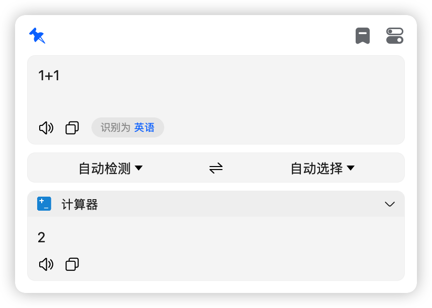
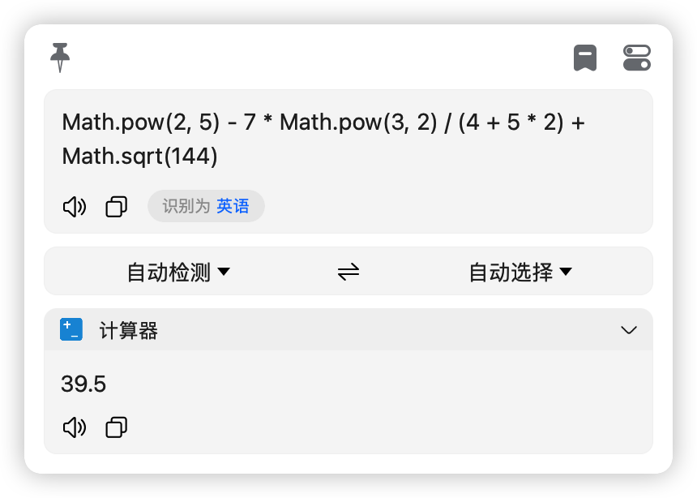

# 计算器

## 我个人为了方便省事，就做了一个简易的计算器，支持 `javascript` 表达式，如果你也用得到的话，就下载试试吧！

> 该功能主要为 bob 用户开发，bob 是一款 macOS 上的翻译软件，官网地址：[bob](https://bobtranslate.com/)
>
> 插件下载地址：[bob-plugin-calculator-v0.0.0.bobplugin](https://github.com/bilibili-ayang/bob-plugin-calculator/releases/download/v0.0.0/bob-plugin-calculator.bobplugin)

### bob 插件大合集:

> [chatGPT 插件(免秘钥，免翻)](https://github.com/bilibili-ayang/bob-plugin-free-chatgpt)

> [必应翻译插件(免秘钥)](https://github.com/bilibili-ayang/bob-plugin-free-bing-translate)

> [百度翻译插件(免秘钥)](https://github.com/bilibili-ayang/bob-plugin-free-baidu-translate)

> [小牛翻译插件(免秘钥)](https://github.com/bilibili-ayang/bob-plugin-free-calf-translate)

> [阿里翻译插件(免秘钥)](https://github.com/bilibili-ayang/bob-plugin-free-ali-translate)

> [爱词霸翻译插件(免秘钥)](https://github.com/bilibili-ayang/bob-plugin-free-iciba-translate)

> [搜狗翻译插件(免秘钥)](https://github.com/bilibili-ayang/bob-plugin-free-sougou-translate)

> [计算器插件](https://github.com/bilibili-ayang/bob-plugin-calculator)

### 使用截图如下：

